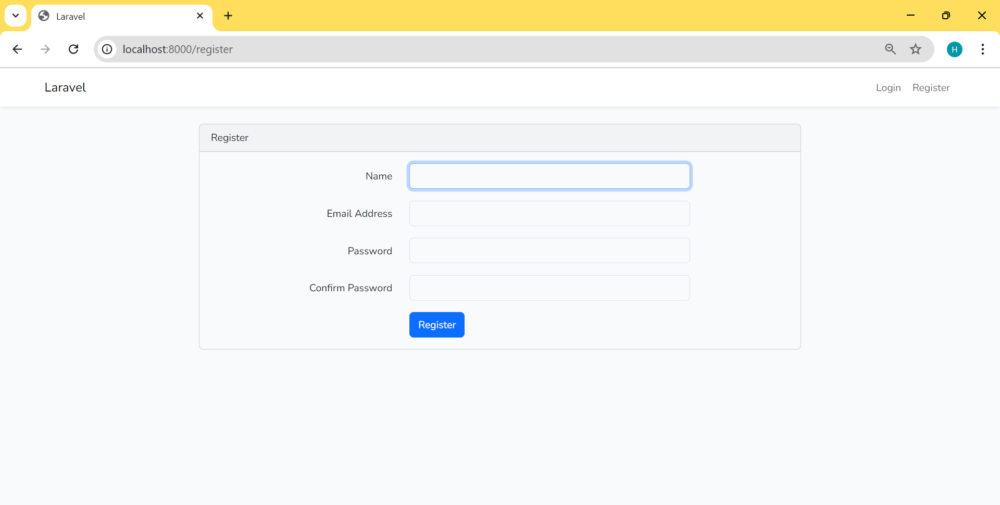

# To-Do List Application

A simple to-do list application built using Laravel. Users can create, edit, delete, and toggle the completion status of tasks.

## Table of Contents

- [Prerequisites](#prerequisites)
- [Installation](#installation)
- [Running the Application](#running-the-application)
- [Usage](#usage)
- [Contributing](#contributing)
- [License](#license)

## Prerequisites

Make sure you have the following installed on your machine:

- [PHP](https://www.php.net/downloads) (>= 8.0)
- [Composer](https://getcomposer.org/download/)
- [MySQL](https://dev.mysql.com/downloads/mysql/)

## Installation

1. **Clone the Repository**

   ```bash
   git clone https://github.com/your-username/todolist.git
   cd todolist

2. **Install Dependencies**

   ```bash
   composer install

3. **Set Up Environment File**

   ```bash
   cp .env.example .env

4. **Generate Application Key**

   ```bash
   php artisan key:generate

5. **Configure Database**

   ```bash
    DB_CONNECTION=mysql
    DB_HOST=127.0.0.1
    DB_PORT=3306
    DB_DATABASE=your_database_name
    DB_USERNAME=your_database_user
    DB_PASSWORD=your_database_password

6. **Generate Application Key**

   ```bash
   php artisan migrate


## Installation

1. **Start the Development Server**

    You can start the Laravel development server with the following command:

    ```bash
       php artisan serve

2. **Access the Application**

    Open your web browser and visit http://127.0.0.1:8000 to access the application.

## Screenshots

## License

The Laravel framework is open-sourced software licensed under the [MIT license](https://opensource.org/licenses/MIT).
